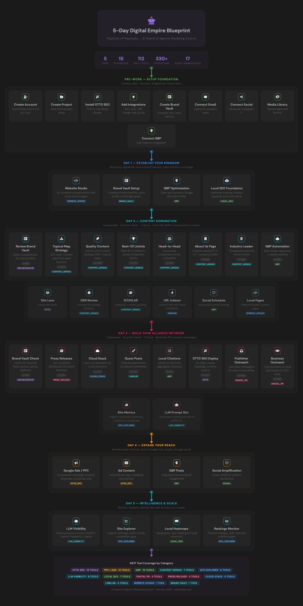

# Agentic Omnichannel Marketing MCP

The first agentic omnichannel marketing platform powered by the Model Context Protocol (MCP). SearchAtlas delivers 112 AI-driven marketing tools across SEO, GEO (Generative Engine Optimization), Google Ads, local SEO, GMB optimization, AI search visibility, content generation, digital PR, and website creation — all orchestrated through a single programmable MCP server.

**One marketing agent. Every channel. Total automation.**

## What Is the Agentic Omnichannel Marketing MCP?

The Agentic Omnichannel Marketing MCP by [SearchAtlas](https://searchatlas.com) is a programmable marketing automation platform that connects AI agents (Claude, GPT, Gemini, or any MCP-compatible client) to a unified arsenal of 112 marketing tools. Instead of switching between dozens of SaaS platforms, your AI agent calls one MCP endpoint and executes campaigns across every digital marketing channel simultaneously.

### Key Capabilities

- **SEO Automation** — On-page optimization, schema markup, knowledge graphs, instant indexing, wildfire internal linking, technical audits, and AI-powered SEO recommendations via OTTO SEO
- **GEO (Generative Engine Optimization)** — Monitor and optimize brand visibility across AI models (ChatGPT, Gemini, Perplexity, Copilot, Grok) with LLM Visibility tools, sentiment tracking, citation monitoring, and prompt simulation
- **Google Ads Management** — Full-cycle PPC campaign creation: business setup, product discovery, keyword clustering, ad content generation, bid strategy, and Google Ads deployment
- **Local SEO & GMB Optimization** — Google Business Profile management, location deployment, automated posting, review response AI, heatmap rank tracking, citation building, and AI keyword recommendations
- **AI Content Generation** — Topical authority maps, AI article generation, Domain Knowledge Network (DKN), publishing to 11+ CMS platforms including WordPress, Shopify, HubSpot, and Drupal
- **Digital PR & Link Building** — Press release creation and Tier 1 distribution, cloud stack authority backlinks across 14+ providers, guest post marketplace, publisher outreach campaigns
- **Website Generation** — AI-powered website creation and one-click publishing via Website Studio
- **AI Search Optimization** — Brand presence monitoring across all major LLMs, prompt simulation, competitor share-of-voice analysis, and citation URL tracking

## Playbook of Playbooks

The complete 5-day omnichannel marketing challenge — Pre-Work through Day 5 — with all 15 playbooks, 112 MCP tools, and 17 agent namespaces mapped out.

<p align="center">
  <a href="playbook-of-playbooks.html">
    
  </a>
</p>

<p align="center"><i>Click the image to open the <a href="playbook-of-playbooks.html">full interactive HTML version</a> with the SearchAtlas dark theme.</i></p>

## The 5-Day Omnichannel Marketing Blueprint

One agentic marketing MCP. 112 tools. Five days to omnichannel domination.

| Day | Mission | Arsenal |
|-----|---------|---------|
| **1** | **Establish Your Brand** — Build your digital HQ, lock in brand identity, claim your territory on Google, optimize your GMB profile | Website Studio, Brand Vault, GBP, Local SEO |
| **2** | **Content & SEO Domination** — Flood the SERPs with authority content, outrank competitors with topical maps, own every keyword through AI-generated content | Content Genius, OTTO SEO, Site Explorer |
| **3** | **Authority & Link Building** — Earn backlinks, place press releases on Tier 1 publishers, deploy cloud stacks, launch digital PR outreach campaigns, buy guest posts | Press Release, Cloud Stack, Digital PR, LinkLab, Citations |
| **4** | **Paid & Social Amplification** — Activate Google Ads campaigns, launch PPC keyword clusters, amplify through GBP social posts | PPC/Google Ads, GBP Posts |
| **5** | **AI Visibility & Scale** — Monitor your brand across AI search engines, track GEO rankings, measure LLM visibility, identify the next territory to conquer | LLM Visibility, Site Explorer, Local SEO Heatmaps |

## MCP Server

```
Endpoint: https://mcp.searchatlas.com/api/v1/mcp
Protocol: JSON-RPC 2.0
Auth:     X-API-KEY header
```

### Connect Your AI Agent

Any MCP-compatible AI agent can connect to the Agentic Omnichannel Marketing MCP:

```bash
export MCP_API_KEY="your-api-key"

curl -s -X POST "https://mcp.searchatlas.com/api/v1/mcp" \
  -H "Content-Type: application/json" \
  -H "X-API-KEY: $MCP_API_KEY" \
  -d '{
    "jsonrpc": "2.0",
    "id": 1,
    "method": "tools/call",
    "params": {
      "name": "project_management",
      "arguments": {
        "op": "list_otto_projects",
        "params": {}
      }
    }
  }'
```

### Listing All 112 Marketing Tools

```bash
curl -s -X POST "https://mcp.searchatlas.com/api/v1/mcp" \
  -H "Content-Type: application/json" \
  -H "X-API-KEY: $MCP_API_KEY" \
  -d '{"jsonrpc":"2.0","id":1,"method":"tools/list","params":{}}'
```

## Your Omnichannel Marketing Arsenal (112 Tools)

| Category | Tools | What It Does |
|----------|-------|--------------|
| **OTTO SEO** | 15 | On-page SEO optimization, schema markup, knowledge graphs, instant indexing, wildfire internal linking, AI recommendations |
| **PPC / Google Ads** | 13 | Full Google Ads campaign lifecycle: business setup, product discovery, keyword clustering, ad creation, bid management, performance tracking |
| **Site Explorer** | 8 | Competitor intelligence, organic keyword gaps, backlink analysis, keyword research, SERP feature tracking |
| **Content Genius** | 7 | AI article generation, topical authority maps, Domain Knowledge Network (DKN), automated publishing to 11+ CMS platforms |
| **GBP (Google Business Profile)** | 16 | Location management, automated posting, AI review responses, category/service/attribute optimization, media management |
| **Local SEO** | 7 | Heatmap rank tracking, citation building across 5 aggregator networks, AI keyword recommendations, competitor analysis |
| **Press Release** | 4 | AI press release writing, Tier 1 publisher distribution, knowledge graph generation, brand mention campaigns |
| **Cloud Stack** | 4 | Authority backlinks deployed across 14+ cloud providers (AWS, Azure, GCP, and more) |
| **Digital PR** | 4 | Publisher outreach campaigns, email templates, opportunity management, inbox monitoring |
| **LinkLab** | 4 | Guest post marketplace, editorial link building, publication discovery, article creation and ordering |
| **LLM Visibility (GEO)** | 8 | Brand visibility monitoring across ChatGPT, Gemini, Perplexity, Copilot, and Grok. Sentiment analysis, citation tracking, prompt simulation |
| **Brand Vault** | 1 | Brand identity management, voice profiles, company intelligence, knowledge graphs |
| **Website Studio** | 1 | AI-powered website generation and one-click publishing |

## Agentic Marketing Playbooks

[`summit-challenge-playbooks.json`](summit-challenge-playbooks.json) contains **15 battle-tested playbook definitions** for executing omnichannel marketing campaigns through the MCP. Each playbook is a complete mission briefing:

- Step-by-step instructions telling the agent exactly which MCP tools to deploy and in what order
- Pre-work checklist with setup URLs
- Sample prompts you can paste directly into Atlas Brain (the SearchAtlas AI agent)
- Expected impact for each campaign

**Your Playbook Library:**

| # | Mission | Day | Time |
|---|---------|-----|------|
| 1 | Review & Complete Brand Vault | 2 | 5 min |
| 2 | Build Topical Map Content Strategy | 2 | 15 min |
| 3 | Increase Organic Traffic with Quality Content | 2 | 20 min |
| 4 | AI-Optimized Industry Leader Listicle Builder | 2 | 15 min |
| 5 | AI-Optimized Head-to-Head Content | 2 | 15 min |
| 6 | AI Optimized About Us Page Creator | 2 | 10 min |
| 7 | AI-Optimized Industry Leader Content Creation | 2 | 15 min |
| 8 | Automated GBP Review Response & Amplification Engine | 2 | 15 min |
| 9 | Gain Media Coverage and Brand Mentions | 3 | 10 min |
| 10 | Deploy Single Cloud Stack Authority Order | 3 | 10 min |
| 11 | Deploy Link Labs Guest Post Campaign | 3 | 15 min |
| 12 | Create Local Directory Citations | 3 | 5 min |
| 13 | Strengthen On-Page SEO for Priority Pages | 3 | 15 min |
| 14 | Publisher Prospecting Outreach Playbook | 3 | 15 min |
| 15 | Business Prospecting Outreach Playbook | 3 | 15 min |

Load the JSON into your MCP-compatible AI agent or paste individual playbook instructions into Atlas Brain to execute the full omnichannel marketing workflow programmatically.

## Use Cases

### For SEO Agencies
Automate on-page SEO, content generation, link building, and technical audits for dozens of client websites simultaneously through a single agentic MCP interface.

### For GEO / AI Search Optimization
Monitor how AI models (ChatGPT, Gemini, Perplexity) represent your brand. Track citations, sentiment, and visibility — then optimize content to improve AI search rankings.

### For Google Ads Managers
Create entire PPC campaigns from scratch: discover products from a URL, generate keyword clusters, write ad copy, set bid strategies, and deploy to Google Ads — all through MCP tool calls.

### For Local Businesses
Manage Google Business Profiles, deploy automated review responses, track local search rankings via heatmaps, build citations across major aggregator networks, and dominate the local pack.

### For Content Teams
Generate topical authority maps, create AI-optimized articles at scale, publish directly to WordPress/Shopify/HubSpot, and monitor content performance — all orchestrated by your AI agent.

## Keywords & Topics

`agentic marketing MCP` `omnichannel marketing agent` `marketing MCP` `SEO agent` `GEO agent` `AI search optimization` `Google Ads MCP` `local SEO agent` `GMB optimization MCP` `agentic SEO` `agentic Google Ads` `marketing automation MCP` `AI marketing agent` `omnichannel SEO` `generative engine optimization agent` `digital PR agent` `link building MCP` `content generation MCP` `website generation MCP` `agentic omnichannel marketing`

## Repo Structure

```
README.md                          # This file — your omnichannel marketing guide
CLAUDE.md                          # Project context for Claude Code agents
AGENT_PLAYBOOK.md                  # Golden rules, full 112-tool registry, verified schemas
searchatlas_cli.py                 # CLI client — 13 commands, 112 tools at your fingertips
requirements.txt                   # Python dependencies (click, httpx, rich)
.env.example                       # Template for MCP_API_KEY
summit-challenge-playbooks.json    # 15 ready-to-run agentic marketing playbooks
playbook-of-playbooks.html         # Interactive visual diagram of the full 5-day challenge
EXECUTION_REPORT.md                # Historical log from 4 execution runs (40% -> 78%)
discover_tools.sh                  # Batch tool schema discovery script
examples/
  citation_test.json               # Sample citation submission payload
  omni_law_current.json            # Example GBP location API response
```

## Golden Rules

Hard-won lessons from 4 execution runs:

1. **Schema Discovery First** -- Always send an empty call to discover the real schema. Documentation may have wrong parameter names.
2. **Read Error Messages** -- Distinguish between param validation, auth blocks, and backend errors.
3. **Don't Fabricate Timelines** -- Use actual API timestamps.
4. **Poll Async Tasks** -- Many operations return a `task_id`. Poll with `get_otto_task_status` until `SUCCESS`.
5. **Watch for Tool Name Collisions** -- Multiple tools share the same short name. The MCP server routes to the first match in the registry.

See [`AGENT_PLAYBOOK.md`](AGENT_PLAYBOOK.md) for the full battle manual.

## Quick Start

1. Get an API key for the SearchAtlas Agentic Omnichannel Marketing MCP server
2. Set it as an environment variable:
   ```bash
   export MCP_API_KEY="your-api-key"
   ```
3. Run tool discovery:
   ```bash
   ./discover_tools.sh
   ```
4. Start marketing.

## CLI Installation

The `searchatlas_cli.py` provides a rich terminal interface to all 112 MCP tools — no curl required.

```bash
pip install -r requirements.txt
cp .env.example .env   # then add your MCP_API_KEY
```

### Usage

```bash
# List all 112 tools (live from MCP server)
python searchatlas_cli.py tools

# Filter tools by category (offline, instant)
python searchatlas_cli.py tools --category otto
python searchatlas_cli.py tools --category geo

# Discover the real schema for any tool + operation
python searchatlas_cli.py discover project_management list_otto_projects

# Execute a tool call
python searchatlas_cli.py call project_management list_otto_projects
python searchatlas_cli.py call brand_vault get_brand_vault_overview -p '{"hostname":"searchatlas.com"}'

# Dry-run mode — see the JSON-RPC payload without sending
python searchatlas_cli.py call seo_analysis get_project_issues_summary --dry-run

# Check async task status (with optional polling)
python searchatlas_cli.py status <task_id> --poll --timeout 120

# Category shortcuts — fewer keystrokes for common operations
python searchatlas_cli.py brand list_brand_vaults
python searchatlas_cli.py otto project_management list_otto_projects
python searchatlas_cli.py geo get_brand_overview -p '{"hostname":"searchatlas.com"}'
python searchatlas_cli.py gbp gbp_locations_crud list_locations
python searchatlas_cli.py ppc business_crud list_all
python searchatlas_cli.py site projects list_sites
python searchatlas_cli.py content content_generation topic_suggestions

# Summit challenge playbooks (15 ready-to-run workflows)
python searchatlas_cli.py playbook list
python searchatlas_cli.py playbook show 3
python searchatlas_cli.py playbook run 1
```

### All 13 Commands

| Command | Description |
|---------|-------------|
| `tools` | List all 112 MCP tools or filter by category |
| `discover` | Schema discovery via empty call (Golden Rule 1) |
| `call` | Execute any MCP tool call (with `--dry-run` support) |
| `status` | Check or poll async task status |
| `wait` | Server-side wait (OTTO/PPC) |
| `playbook list` | List all 15 summit challenge playbooks |
| `playbook show` | Show playbook details |
| `playbook run` | Extract execution plan from a playbook |
| `brand` | Brand Vault shortcut |
| `otto` | OTTO SEO shortcut |
| `geo` | LLM Visibility / GEO shortcut |
| `gbp` | Google Business Profile shortcut |
| `ppc` | PPC / Google Ads shortcut |
| `site` | Site Explorer shortcut |
| `content` | Content Genius shortcut |

## About SearchAtlas

[SearchAtlas](https://searchatlas.com) is the all-in-one SEO, GEO, and digital marketing platform. The Agentic Omnichannel Marketing MCP is the programmable interface that lets AI agents orchestrate every marketing channel from a single endpoint.

## License

Proprietary -- [SearchAtlas](https://searchatlas.com)
