# MCP Agent — Build and Conquer Your Digital Empire

Your AI-powered command center for creating and conquering digital empires. This framework turns the [SearchAtlas](https://searchatlas.com) MCP (Model Context Protocol) into a programmable army of 112 tools that build your online presence, crush competitors in search, and establish dominance across every digital channel — all on autopilot.

## Playbook of Playbooks

> **[View the full interactive diagram (HTML)](playbook-of-playbooks.html)** — Open locally for the complete visual with the SearchAtlas dark theme, color-coded days, namespace tags, and tool coverage breakdown.

```mermaid
flowchart TD
    HQ["<b>5-Day Digital Empire Blueprint</b><br/><i>15 Playbooks · 112 MCP Tools · 330+ Operations · 17 Agent Namespaces</i>"]

    HQ --> PRE

    subgraph PRE["🟢 PRE-WORK — Setup Foundation"]
        direction LR
        P1["Create Account"]
        P2["Create Project"]
        P3["Install OTTO SEO"]
        P4["Add Integrations<br/><i>GSC · GA4 · GBP · Ads · Social</i>"]
        P5["Create Brand Vault"]
        P6["Connect Email"]
        P7["Connect Social"]
        P8["Media Library"]
        P9["Connect GBP"]
    end

    PRE --> D1

    subgraph D1["🔵 DAY 1 — Establish Your Kingdom"]
        direction LR
        D1A["🌐 Website Studio<br/><i>website_studio</i>"]
        D1B["🏛️ Brand Vault Setup<br/><i>brand_vault</i>"]
        D1C["📍 GBP Optimization<br/><i>gbp</i>"]
        D1D["🗺️ Local SEO Foundation<br/><i>local_seo</i>"]
    end

    D1 --> D2

    subgraph D2["🔷 DAY 2 — Content Domination  ·  8 Playbooks  ·  ~2 hrs"]
        direction LR
        D2A["1. Review Brand Vault<br/><i>5 min · orchestrator</i>"]
        D2B["2. Topical Map Strategy<br/><i>15 min · content_genius</i>"]
        D2C["3. Quality Content<br/><i>20 min · content_genius</i>"]
        D2D["4. Best-Of Listicle<br/><i>15 min · content_genius</i>"]
        D2E["5. Head-to-Head<br/><i>15 min · content_genius</i>"]
        D2F["6. About Us Page<br/><i>10 min · content_genius</i>"]
        D2G["7. Industry Leader<br/><i>15 min · content_genius</i>"]
        D2H["8. GBP Automation<br/><i>15 min · gbp</i>"]
    end

    D2 --> D2X

    subgraph D2X["DAY 2 — Additional Tools"]
        direction LR
        D2X1["Site Lens<br/><i>otto</i>"]
        D2X2["DKN Review<br/><i>content_genius</i>"]
        D2X3["SCHOLAR<br/><i>content_genius</i>"]
        D2X4["URL Indexer<br/><i>indexer</i>"]
        D2X5["Social Schedule<br/><i>gbp</i>"]
        D2X6["Local Pages<br/><i>website_studio</i>"]
    end

    D2X --> D3

    subgraph D3["🔴 DAY 3 — Build Your Alliance Network  ·  7 Playbooks  ·  ~2 hrs"]
        direction LR
        D3A["9. Brand Vault Check<br/><i>5 min · orchestrator</i>"]
        D3B["10. Press Releases<br/><i>10 min · press_release</i>"]
        D3C["11. Cloud Stack<br/><i>10 min · cloud_stack</i>"]
        D3D["12. Guest Posts<br/><i>15 min · linklab</i>"]
        D3E["13. Local Citations<br/><i>5 min · gbp</i>"]
        D3F["14. OTTO SEO Deploy<br/><i>15 min · otto</i>"]
        D3G["15. Publisher Outreach<br/><i>15 min · digital_pr</i>"]
        D3H["16. Business Outreach<br/><i>15 min · digital_pr</i>"]
    end

    D3 --> D3X

    subgraph D3X["DAY 3 — Additional Tools"]
        direction LR
        D3X1["Site Metrics<br/><i>site_explorer</i>"]
        D3X2["LLM Prompt Simulator<br/><i>llm_visibility</i>"]
    end

    D3X --> D4

    subgraph D4["🟠 DAY 4 — Expand Your Reach"]
        direction LR
        D4A["📢 Google Ads / PPC<br/><i>otto_ppc</i>"]
        D4B["📝 Ad Content<br/><i>otto_ppc</i>"]
        D4C["📍 GBP Posts<br/><i>gbp</i>"]
        D4D["❤️ Social Amplification<br/><i>social</i>"]
    end

    D4 --> D5

    subgraph D5["🔷 DAY 5 — Intelligence & Scale"]
        direction LR
        D5A["🤖 LLM Visibility<br/><i>llm_visibility</i>"]
        D5B["📈 Site Explorer<br/><i>site_explorer</i>"]
        D5C["🗺️ Local Heatmaps<br/><i>local_seo</i>"]
        D5D["📊 Rankings Monitor<br/><i>site_explorer</i>"]
    end

    D5 --> TOOLS

    subgraph TOOLS["MCP Tool Coverage — 112 Tools across 13 Categories"]
        direction LR
        T1["OTTO SEO · 15"]
        T2["PPC/Ads · 13"]
        T3["GBP · 16"]
        T4["Content Genius · 7"]
        T5["Site Explorer · 8"]
        T6["LLM Visibility · 8"]
        T7["Local SEO · 7"]
        T8["Digital PR · 4"]
        T9["Press Release · 4"]
        T10["Cloud Stack · 4"]
        T11["LinkLab · 4"]
        T12["Website Studio · 1"]
        T13["Brand Vault · 1"]
    end

    %% Styling
    classDef header fill:#936BDA22,stroke:#936BDA,stroke-width:2px,color:#AAAAAA
    classDef prework fill:#4CAF5011,stroke:#4CAF50,stroke-width:1px,color:#81C784
    classDef day1 fill:#2196F311,stroke:#2196F3,stroke-width:1px,color:#64B5F6
    classDef day2 fill:#00BCD411,stroke:#00BCD4,stroke-width:1px,color:#4DD0E1
    classDef day3 fill:#E91E6311,stroke:#E91E63,stroke-width:1px,color:#F48FB1
    classDef day4 fill:#FF980011,stroke:#FF9800,stroke-width:1px,color:#FFB74D
    classDef day5 fill:#00BCD411,stroke:#00BCD4,stroke-width:1px,color:#4DD0E1
    classDef tools fill:#936BDA11,stroke:#936BDA,stroke-width:1px,color:#B89AED
    classDef extra fill:#FFFFFF08,stroke:#FFFFFF15,stroke-width:1px,stroke-dasharray:5 5,color:#535353

    class HQ header
    class PRE prework
    class D1 day1
    class D2 day2
    class D2X extra
    class D3 day3
    class D3X extra
    class D4 day4
    class D5 day5
    class TOOLS tools
```



## The 5-Day Empire Blueprint

One agent. 112 tools. Five days to total digital dominance.

| Day | Mission | Arsenal |
|-----|---------|---------|
| **1** | **Establish Your Kingdom** — Build your digital HQ, lock in brand identity, claim your territory on Google | Website Studio, Brand Vault, GBP, Local SEO |
| **2** | **Content Domination** — Flood the SERPs with authority content, outrank competitors with topical maps, own every keyword | Content Genius, OTTO SEO, Site Explorer |
| **3** | **Build Your Alliance Network** — Earn backlinks, place press releases on Tier 1 publishers, deploy cloud stacks, launch outreach campaigns | Press Release, Cloud Stack, Digital PR, LinkLab, Citations |
| **4** | **Expand Your Reach** — Activate paid channels, launch Google Ads, amplify through social | PPC/Google Ads, GBP Posts |
| **5** | **Intelligence & Scale** — Monitor your empire, track rankings, measure AI visibility, identify the next territory to conquer | LLM Visibility, Site Explorer, Local SEO Heatmaps |

## MCP Server

```
Endpoint: https://mcp.searchatlas.com/api/v1/mcp
Protocol: JSON-RPC 2.0
Auth:     X-API-KEY header
```

### Calling a Tool

```bash
export MCP_API_KEY="your-api-key"

curl -s -X POST "https://mcp.searchatlas.com/api/v1/mcp" \
  -H "Content-Type: application/json" \
  -H "X-API-KEY: $MCP_API_KEY" \
  -d '{
    "jsonrpc": "2.0",
    "id": 1,
    "method": "tools/call",
    "params": {
      "name": "project_management",
      "arguments": {
        "op": "list_otto_projects",
        "params": {}
      }
    }
  }'
```

### Listing All Tools

```bash
curl -s -X POST "https://mcp.searchatlas.com/api/v1/mcp" \
  -H "Content-Type: application/json" \
  -H "X-API-KEY: $MCP_API_KEY" \
  -d '{"jsonrpc":"2.0","id":1,"method":"tools/list","params":{}}'
```

## Your Arsenal (112 tools)

| Category | Tools | What It Conquers |
|----------|-------|------------------|
| **OTTO SEO** | 15 | On-page optimization, schema markup, knowledge graphs, instant indexing, wildfire backlinks |
| **PPC / Google Ads** | 13 | Campaign creation, ad groups, keyword targeting, product feeds, bid management |
| **Site Explorer** | 8 | Competitor intelligence, organic keyword gaps, backlink analysis, keyword research |
| **Content Genius** | 7 | AI article generation, topical authority maps, DKN, publishing to 11+ CMS platforms |
| **GBP** | 16 | Location management, automated posting, review responses, local search domination |
| **Local SEO** | 7 | Heatmap tracking, citation building, AI recommendations, local rank monitoring |
| **Press Release** | 4 | Tier 1 publisher distribution, knowledge graphs, brand mention campaigns |
| **Cloud Stack** | 4 | Authority backlinks across 14+ cloud providers |
| **Digital PR** | 4 | Publisher outreach campaigns, email templates, inbox management |
| **LinkLab** | 4 | Guest post placements, publisher marketplace, editorial link building |
| **LLM Visibility** | 8 | Brand presence across AI models, sentiment tracking, citation monitoring, prompt simulation |
| **Brand Vault** | 1 | Brand identity, voice profiles, company intelligence |
| **Website Studio** | 1 | AI website generation and one-click publishing |

## Summit Challenge Playbooks

[`summit-challenge-playbooks.json`](summit-challenge-playbooks.json) contains **15 battle-tested playbook definitions** from the AI Search & Agentic Marketing Summit weekly challenge. Each playbook is a complete mission briefing:

- Step-by-step instructions telling the agent exactly which MCP tools to deploy and in what order
- Pre-work checklist with setup URLs
- Sample prompts you can paste directly into Atlas Brain
- Expected impact for each campaign

**Your Playbook Library:**

| # | Mission | Day | Time |
|---|---------|-----|------|
| 1 | Review & Complete Brand Vault | 2 | 5 min |
| 2 | Build Topical Map Content Strategy | 2 | 15 min |
| 3 | Increase Organic Traffic with Quality Content | 2 | 20 min |
| 4 | AI-Optimized Industry Leader Listicle Builder | 2 | 15 min |
| 5 | AI-Optimized Head-to-Head Content | 2 | 15 min |
| 6 | AI Optimized About Us Page Creator | 2 | 10 min |
| 7 | AI-Optimized Industry Leader Content Creation | 2 | 15 min |
| 8 | Automated GBP Review Response & Amplification Engine | 2 | 15 min |
| 9 | Gain Media Coverage and Brand Mentions | 3 | 10 min |
| 10 | Deploy Single Cloud Stack Authority Order | 3 | 10 min |
| 11 | Deploy Link Labs Guest Post Campaign | 3 | 15 min |
| 12 | Create Local Directory Citations | 3 | 5 min |
| 13 | Strengthen On-Page SEO for Priority Pages | 3 | 15 min |
| 14 | Publisher Prospecting Outreach Playbook | 3 | 15 min |
| 15 | Business Prospecting Outreach Playbook | 3 | 15 min |

Load the JSON into your agent or paste individual playbook instructions into Atlas Brain to execute the full challenge workflow programmatically.

## Repo Structure

```
README.md                          # This file — your empire-building guide
CLAUDE.md                          # Project context for Claude Code agents
AGENT_PLAYBOOK.md                  # Golden rules, full 112-tool registry, verified schemas
summit-challenge-playbooks.json    # 15 ready-to-run summit challenge playbooks
playbook-of-playbooks.html         # Interactive visual diagram of the full 5-day challenge
EXECUTION_REPORT.md                # Historical log from 4 execution runs (40% -> 78%)
discover_tools.sh                  # Batch tool schema discovery script
examples/
  citation_test.json               # Sample citation submission payload
  omni_law_current.json            # Example GBP location API response
```

## Golden Rules

Hard-won lessons from 4 execution runs:

1. **Schema Discovery First** -- Always send an empty call to discover the real schema. Documentation has wrong parameter names for many tools.
2. **Read Error Messages** -- Distinguish between param validation, auth blocks, and backend errors.
3. **Don't Fabricate Timelines** -- Use actual API timestamps.
4. **Poll Async Tasks** -- Many operations return a `task_id`. Poll with `get_otto_task_status` until `SUCCESS`.
5. **Watch for Tool Name Collisions** -- Multiple tools share the same short name. The MCP server routes to the first match in the registry.

See [`AGENT_PLAYBOOK.md`](AGENT_PLAYBOOK.md) for the full battle manual.

## Quick Start

1. Get an API key for the SearchAtlas MCP server
2. Set it as an environment variable:
   ```bash
   export MCP_API_KEY="your-api-key"
   ```
3. Run tool discovery:
   ```bash
   ./discover_tools.sh
   ```
4. Start conquering.

## License

Proprietary -- [SearchAtlas](https://searchatlas.com)
